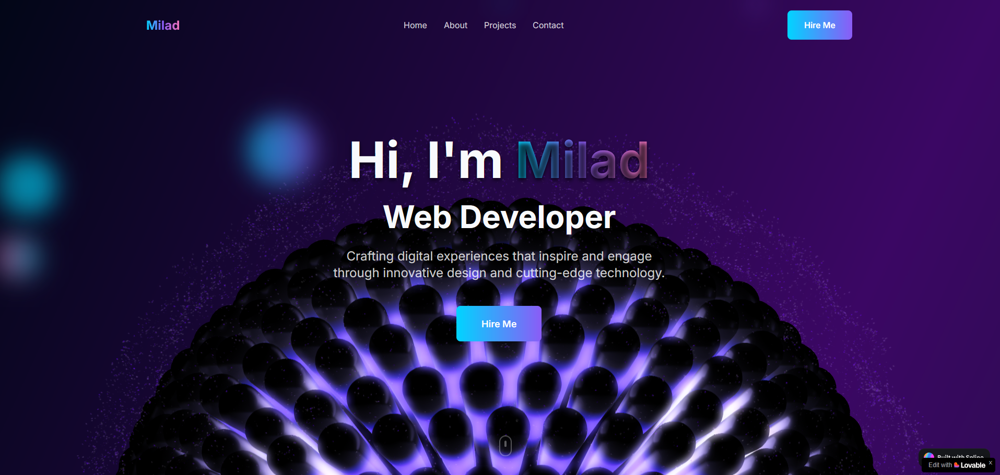

## Introduction: 
#### 🎬 In this tutorial, you'll learn how to build a stunning 3D animated portfolio website using the Lovable AI tool — completely with no code! Whether you're a designer, developer, or beginner, this step-by-step guide will show you how to craft a fully responsive, futuristic website packed with cutting-edge animations and 3D visuals.

#### What You’ll Learn:
#### 🎯 What You’ll Learn:
#### ✅ How to use Lovable AI to design a portfolio website with no coding skills
#### ✅ Adding powerful GSAP animations to bring your site to life
#### ✅ Creating smooth parallax scrolling effects with Locomotive Scroll
#### ✅ Integrating Spline 3D models into your hero section without writing a single line of code
#### ✅ Designing an interactive, fully responsive portfolio website for all devices

## Watch the full tutorial on YouTub
